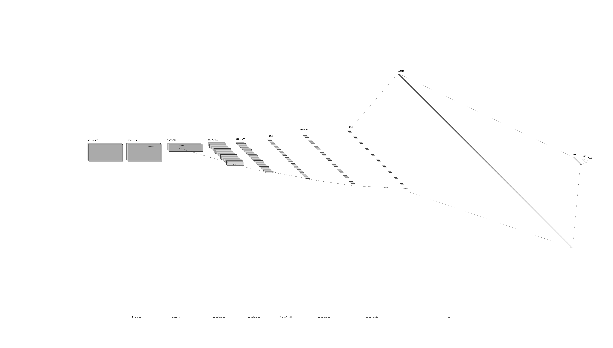

# Behavioral Cloning of a Car using Simulation 

The goals / steps of this project are the following:

* Gather data from the simulation for training
* Create a Neural Networks architecture and model using Keras
* Augmented the data by flipping the images and steering direction to provide more training data
* Train the model 
* Fine tune the model by gathering more appropriate data or adjusting the model

## Setup and Running Instruction

### Installation
1. Download the simulation from this link
2. Clone this repository

### Running the Model
1. Open the simulation in Autonomous mode
2. Run `python drive.py model.h5`

### Gathering Data
1. Run the simulation in training mode
2. Press `R` or click on record button, then choose a folder where the data will be save
3. Drive the car around and press `R` again to stop. The images of the camera will be save in the folder along with the steering value in a csv file.

### Training Data
1. Specify the data folder in `model.py` that you want to train the network on
2. Run `python model.py`

## Model Architecture

The architecture is similar to Nvidia deep learning network, but I experiment with the number of filter and layer.

### Model Summary

|Layer (type)           |      Output Shape        |      Param #  | 
|:--------------------:|:--------------------:|:-------------:|
|lambda_18 (Lambda)       |    (None, 160, 320, 3)   |    0         |
|cropping2d_18 (Cropping2D) |  (None, 65, 320, 3)    |    0         
|conv2d_49 (Conv2D)        | (None, 31, 158, 24)    |   1824      
|conv2d_50 (Conv2D)        | (None, 14, 77, 36)    |    21636     
|conv2d_51 (Conv2D)        | (None, 5, 37, 48)     |    43248     
|conv2d_52 (Conv2D)        |  (None, 3, 35, 64)    |     27712     
|conv2d_53 (Conv2D)        |   (None, 1, 33, 70)    |     40390     
|flatten_12 (Flatten)      |    (None, 2310)        |      0         
|dense_37 (Dense)          |     (None, 100)        |       231100    
|dense_38 (Dense)         |      (None, 50)       |         5050      
|dense_39 (Dense)        |       (None, 10)         |       510       
|dense_40 (Dense)       |        (None, 1)          |       11        

Total params: 371,481

Trainable params: 371,481

Non-trainable params: 0

### Description

#### Lambda

The lambda layer is used for normalizing the image so the value is between 0 and 1.

#### Cropping

The cropping layer remove the sky region and the region that the car hood which doesn't help the model to determine the direction that it should drive toward to. Removing them will increase performance speed.

#### Convolution Neural Network

Multiple layers of Convolution Neural Network are used to detect different feature of the scenary to determine the driving direction. Each layer have different number of filter for detecting different feauture.

#### Flatten

Flatten layer convert the input into a single row

#### Dense

Dense Layer find the 

### Training Process

The model is train using Mean Square Error (MSE) loss and Adam optimizer. The number of epoch for each training is 2 and the validation data is 20% of the entire data. However, the model is retrain multiple time with different dataset to tune it.

The model is train on the `normal_drive` dataset initially which is just the car driving along the center of the road. After looking at the result, it still need improvement when learning to avoid the curve. Afterwards, the data is train with `gap_and_curve` data so it knows how to deal with curvature and also gap on the road. The training is done a few more time that the first dataset to priority this motion. Finally, the data is train with `avoid_edge` dataset so it knows to go back to center if the car is near the edges.

Originally, the model include dropout layer to prevent overfitting. However, after testing with simulation, the dropout layer cause the car to always go beyond the road edge, even after lowering the dropout rate. Therefore, I decided to remove it. This could cause overfitting in the long run, but from the training and validation loss, they are relatively equal with higher loss in the training.

## Discussion

### Problem

Gathering data took a lot of time, as expected for machine learning problem. Also, the type of data gather also effect the model. Therefore, I gather different type of dataset and then tune the model by training it different time.

### Further Improvement

In the future, the model will require more data as well as regularization or dropout to prevent overfitting. Currently, it cannot deal with the road in the challenge map. By gather data from both map, it can generalize the lane better and know the steering action the car should use.